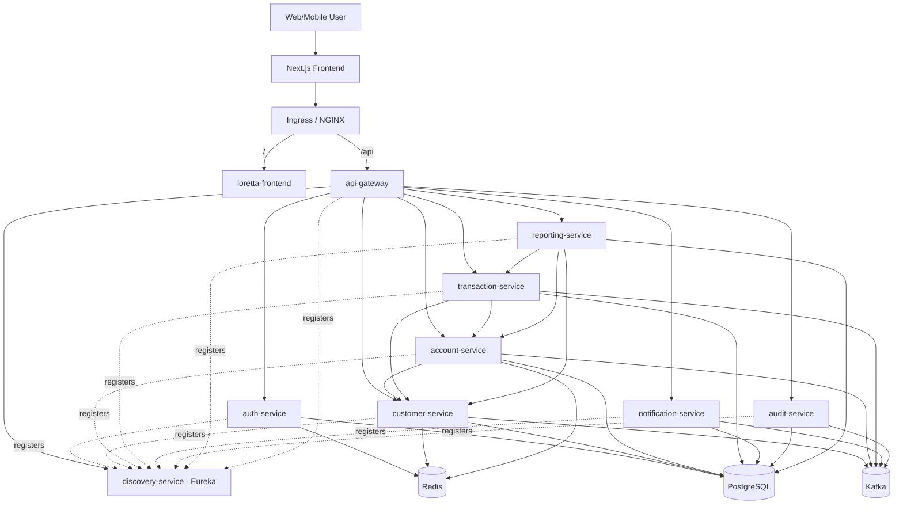

# Loretta Bank - Microservices Banking System

A production-grade full-stack banking platform built with Java 21, Spring Boot 3.4, Next.js 14, and microservices architecture.

## Architecture


## Services

| Service | Port | Description |
|---------|------|-------------|
| **discovery-service** | 8761 | Eureka service registry |
| **api-gateway** | 8080 | Entry point, JWT validation, rate limiting |
| **auth-service** | 8081 | Authentication, JWT tokens, user management |
| **customer-service** | 8082 | Customer profiles, KYC status |
| **account-service** | 8083 | Bank accounts, balances, deposits/withdrawals |
| **transaction-service** | 8084 | Double-entry ledger, transfers with saga pattern |
| **notification-service** | 8085 | Event-driven notifications (email/SMS stubs) |
| **audit-service** | 8086 | Immutable audit log from domain events |
| **reporting-service** | 8087 | Account statements and reports |

## Tech Stack

- **Java 21** + **Spring Boot 3.4**
- **Spring Cloud** (Eureka, Gateway)
- **PostgreSQL** (per-service databases)
- **Apache Kafka** (domain events, outbox pattern)
- **Redis** (caching, token blacklist, rate limiting)
- **Flyway** (database migrations)
- **MapStruct** + **Lombok** (mapping, boilerplate)
- **SpringDoc OpenAPI** (Swagger UI per service)
- **Micrometer/Prometheus** (metrics)
- **Testcontainers** (integration tests)
- **Spotless** (code formatting)

## Key Patterns

- **Outbox Pattern**: Events published via transactional outbox to avoid dual-write issues
- **Saga Pattern**: Orchestration-based saga for inter-account transfers with compensation
- **Double-Entry Ledger**: Every transaction creates matching debit/credit entries
- **CQRS-lite**: Separate read/write paths where applicable
- **JWT + Gateway Auth**: Gateway validates tokens and forwards user context headers

## Prerequisites

- Docker & Docker Compose
- Java 21 (for local dev without Docker)
- Maven 3.9+ (for local dev without Docker)

## Quick Start

### With Docker Compose (recommended)

```bash
docker compose up --build
```

This starts: PostgreSQL, Kafka, Redis, and all 9 microservices.

Wait for all services to register with Eureka (check http://localhost:8761).

Default bootstrap admin user (created by `auth-service` on first start):

- Email: `admin@lorettabank.co.za`
- Password: `AdminPass123!`

You can change these via `AUTH_BOOTSTRAP_ADMIN_EMAIL` and `AUTH_BOOTSTRAP_ADMIN_PASSWORD`.

### Local Development

1. Start infrastructure:
```bash
docker compose up postgres kafka redis
```

2. Build and run:
```bash
cd server
mvn clean install -DskipTests
```

3. Run services individually:
```bash
cd server/discovery-service && mvn spring-boot:run
cd server/api-gateway && mvn spring-boot:run
cd server/auth-service && mvn spring-boot:run
# ... etc
```

## Frontend Container

The Next.js frontend lives in `client/` and can be built as a container image:

```bash
docker build \
  -f client/Dockerfile \
  -t loretta-bank-client \
  --build-arg NEXT_PUBLIC_API_URL=http://localhost:8080 \
  client
```

## Kubernetes Frontend

Frontend Kubernetes manifests are in `k8s/frontend/` (`Deployment`, `Service`, `Ingress`, and `kustomization.yaml`).

For full build/push/apply steps, see [k8s/frontend/README.md](k8s/frontend/README.md).

## Kubernetes Full Stack

Full Kubernetes manifests for frontend + backend + in-cluster infrastructure are in `k8s/all/`.

For image build/push and cluster deployment instructions, see [k8s/all/README.md](k8s/all/README.md).

For local Minikube deployment, run `scripts/deploy-minikube.ps1`.

## AWS EKS Terraform (Low Cost)

Terraform for a cost-optimized AWS EKS cluster is in `terraform/aws-eks-cheap/`.

For provisioning steps and cost tradeoffs, see [terraform/aws-eks-cheap/README.md](terraform/aws-eks-cheap/README.md).

## Sample API Flow

All requests go through the gateway at `http://localhost:8080`.

### 1. Register a User

```bash
curl -X POST http://localhost:8080/api/v1/auth/register \
  -H "Content-Type: application/json" \
  -d '{
    "email": "john@lorettabank.co.za",
    "password": "SecurePass123!",
    "firstName": "John",
    "lastName": "Doe"
  }'
```

### 2. Login

```bash
curl -X POST http://localhost:8080/api/v1/auth/login \
  -H "Content-Type: application/json" \
  -d '{
    "email": "john@lorettabank.co.za",
    "password": "SecurePass123!"
  }'
```

Save the `accessToken` from the response.

### 3. Create Customer Profile

```bash
export TOKEN="<your-access-token>"

curl -X POST http://localhost:8080/api/v1/customers \
  -H "Content-Type: application/json" \
  -H "Authorization: Bearer $TOKEN" \
  -d '{
    "userId": 1,
    "firstName": "John",
    "lastName": "Doe",
    "email": "john@lorettabank.co.za",
    "phoneNumber": "+27821234567",
    "idNumber": "9501015800089",
    "dateOfBirth": "1995-01-01",
    "address": "123 Main Street, Cape Town, 8001"
  }'
```

### 4. Open an Account

```bash
curl -X POST http://localhost:8080/api/v1/accounts \
  -H "Content-Type: application/json" \
  -H "Authorization: Bearer $TOKEN" \
  -d '{
    "customerId": 1,
    "accountType": "CHECKING",
    "currency": "ZAR",
    "initialDeposit": 10000.00
  }'
```

### 5. Deposit Money

```bash
curl -X POST http://localhost:8080/api/v1/accounts/1/deposit \
  -H "Content-Type: application/json" \
  -H "Authorization: Bearer $TOKEN" \
  -H "Idempotency-Key: dep-$(uuidgen)" \
  -d '{
    "amount": 5000.00,
    "reference": "Salary deposit"
  }'
```

### 6. Transfer Between Accounts

```bash
curl -X POST http://localhost:8080/api/v1/transfers \
  -H "Content-Type: application/json" \
  -H "Authorization: Bearer $TOKEN" \
  -H "Idempotency-Key: xfer-$(uuidgen)" \
  -d '{
    "sourceAccountId": 1,
    "targetAccountId": 2,
    "amount": 2000.00,
    "currency": "ZAR",
    "description": "Savings transfer"
  }'
```

### 7. View Transactions

```bash
curl http://localhost:8080/api/v1/transactions/account/1 \
  -H "Authorization: Bearer $TOKEN"
```

### 8. Generate Statement

```bash
curl -X POST http://localhost:8080/api/v1/reports/statements \
  -H "Content-Type: application/json" \
  -H "Authorization: Bearer $TOKEN" \
  -d '{
    "accountId": 1,
    "periodFrom": "2025-01-01T00:00:00",
    "periodTo": "2025-12-31T23:59:59"
  }'
```

### 9. View Audit Trail (Admin)

```bash
curl http://localhost:8080/api/v1/audit?page=0&size=20 \
  -H "Authorization: Bearer $ADMIN_TOKEN"
```

### 10. Promote a user role (Admin)

```bash
curl -X PUT http://localhost:8080/api/v1/auth/users/2/role \
  -H "Authorization: Bearer $ADMIN_TOKEN" \
  -H "Content-Type: application/json" \
  -d '{"role":"SUPPORT"}'
```

## Swagger UI

Each service exposes OpenAPI docs:
- Auth: http://localhost:8081/swagger-ui.html
- Customer: http://localhost:8082/swagger-ui.html
- Account: http://localhost:8083/swagger-ui.html
- Transaction: http://localhost:8084/swagger-ui.html
- Notification: http://localhost:8085/swagger-ui.html
- Audit: http://localhost:8086/swagger-ui.html
- Reporting: http://localhost:8087/swagger-ui.html

## Roles & Authorization

| Role | Capabilities |
|------|-------------|
| **CUSTOMER** | Own profile, own accounts, own transactions, own statements |
| **SUPPORT** | Read-only access to customer data, accounts, audit logs |
| **ADMIN** | Full access: manage users, KYC, freeze/close accounts, audit |

## Testing

```bash
cd server
mvn test                          # Unit tests
mvn verify                        # Unit + integration tests
mvn spotless:check                # Check formatting
mvn spotless:apply                # Fix formatting
```

## Monitoring

- **Health checks**: `GET /actuator/health` on each service
- **Metrics**: `GET /actuator/prometheus` (Prometheus format)
- **Eureka dashboard**: http://localhost:8761

## Design Decisions

1. **Outbox Pattern over direct Kafka publish**: Ensures atomicity between DB writes and event publishing. A scheduled poller reads unpublished events and sends them to Kafka.

2. **Orchestration Saga for transfers**: The transaction-service orchestrates the transfer saga (debit source -> credit target) with compensation on failure, rather than choreography, for easier reasoning and debugging.

3. **Gateway-based auth**: The API gateway validates JWTs and forwards user context (X-User-Id, X-User-Roles) to downstream services. Services trust these headers since they're only reachable through the gateway.

4. **BigDecimal with scale 4**: All monetary values use `NUMERIC(19,4)` for precision. Currency defaults to ZAR but is extensible.

5. **Separate databases per service**: Each service has its own PostgreSQL database for data isolation, following microservices best practices.

## License

MIT License - see [LICENSE](LICENSE)

