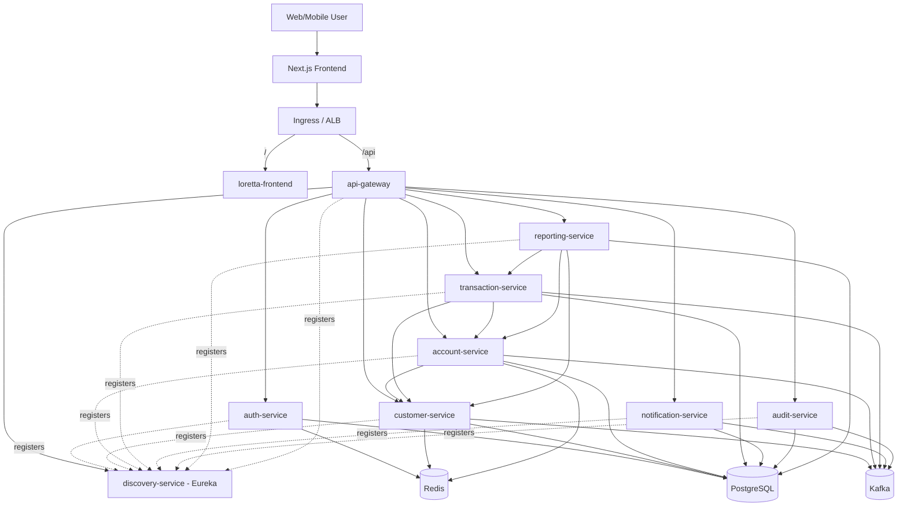

# Loretta Bank

A full-stack banking platform built with Java 21, Spring Boot 3.4, and Next.js. Nine microservices handle authentication, customers, accounts, transactions, notifications, auditing, and reporting, all wired together with Eureka, Kafka, Redis, and PostgreSQL.

## Architecture



## Services

| Service | Port | Description |
|---------|------|-------------|
| **discovery-service** | 8761 | Eureka service registry |
| **api-gateway** | 8080 | Entry point, JWT validation, rate limiting |
| **auth-service** | 8081 | Authentication, JWT tokens, user management |
| **customer-service** | 8082 | Customer profiles, KYC status |
| **account-service** | 8083 | Bank accounts, balances, deposits/withdrawals |
| **transaction-service** | 8084 | Double-entry ledger, transfers with saga pattern |
| **notification-service** | 8085 | Event-driven notifications (email/SMS stubs) |
| **audit-service** | 8086 | Immutable audit log from domain events |
| **reporting-service** | 8087 | Account statements and reports |
| **frontend** | 3000 | Next.js 14 web client |

## Tech Stack

**Backend:** Java 21, Spring Boot 3.4, Spring Cloud (Eureka, Gateway), Flyway, MapStruct, Lombok, SpringDoc OpenAPI, Micrometer/Prometheus, Testcontainers, Spotless

**Frontend:** Next.js 14, TypeScript, Tailwind CSS

**Infrastructure:** PostgreSQL 16 (per-service databases), Apache Kafka (domain events, outbox pattern), Redis (caching, token blacklist, rate limiting)

**DevOps:** Docker Compose (local), Helm (Kubernetes), Terraform (AWS EKS/RDS/ElastiCache/MSK), GitHub Actions CI/CD

## Quick Start

### Docker Compose (recommended)

```bash
cp .env.example .env        # review and customise if needed
docker compose up --build
```

| Endpoint | URL |
|----------|-----|
| Frontend | http://localhost:3000 |
| API Gateway | http://localhost:8080 |
| Eureka Dashboard | http://localhost:8761 |

Default admin: `admin@lorettabank.co.za` / `AdminPass123!` (created on first boot by auth-service).

### Local Development (infrastructure only)

```bash
docker compose up postgres kafka redis    # start infra
cd server && mvn clean install -DskipTests  # build all modules
cd discovery-service && mvn spring-boot:run # start services one by one
```

## Deployment

### Environments

| Environment | Infra | Trigger |
|-------------|-------|---------|
| **Local** | Docker Compose (Postgres, Kafka, Redis in containers) | `docker compose up` |
| **Staging** | EKS + in-cluster infra via Helm | Push to `main` |
| **Production** | EKS + managed AWS (RDS, ElastiCache, MSK) | Manual `workflow_dispatch` |

### Helm Charts

The Kubernetes deployment uses an **umbrella Helm chart** with 14 subcharts:

```
helm/loretta-bank/
  Chart.yaml                 # Declares all subchart dependencies
  values.yaml                # Dev/staging defaults (in-cluster infra enabled)
  values-production.yaml     # Production overrides (managed AWS services)
  charts/
    config/                  # Shared ConfigMap + Secret + ExternalSecret
    postgres/ redis/ kafka/  # In-cluster infra (disabled in prod)
    discovery-service/       # Each service: Deployment + Service
    api-gateway/
    auth-service/
    ...
    frontend/                # Deployment + Service + Ingress
```

**How it works:**
- `global.*` values (DB host, Kafka brokers, Redis host, JVM opts) flow down to all subcharts
- Infrastructure subcharts toggle via `postgres.enabled`, `redis.enabled`, `kafka.enabled`
- In production, these are `false` and services point to RDS/ElastiCache/MSK endpoints instead
- Secrets are injected via `ExternalSecret` CRs (from AWS Secrets Manager) when `global.externalSecrets.enabled: true`

```bash
# Lint
helm lint helm/loretta-bank

# Dry-run
helm install loretta-bank ./helm/loretta-bank --dry-run

# Deploy to staging (in-cluster infra)
helm upgrade --install loretta-bank ./helm/loretta-bank \
  --namespace loretta-bank --create-namespace

# Deploy to production (managed AWS services)
helm upgrade --install loretta-bank ./helm/loretta-bank \
  --namespace loretta-bank --create-namespace \
  --values helm/loretta-bank/values-production.yaml
```

### CI/CD Pipeline

**CI** (`.github/workflows/ci.yml`) runs on every PR:
1. Java build + test (`mvn verify` with Postgres/Redis service containers)
2. Spotless formatting check + Checkstyle static analysis
3. Helm chart linting
4. Docker image build (matrix across all 10 images, no push)

**CD** (`.github/workflows/cd.yml`) has two trigger modes:

| Trigger | What happens |
|---------|-------------|
| **Push to `main`** | Builds and deploys **all** services to **staging** |
| **Manual dispatch** | Pick **environment** (staging/production) and toggle **per-service feature flags** |

The manual dispatch lets you deploy individual services. For example, to push only `auth-service` and `api-gateway` to production, run the workflow manually and toggle just those two on.

### AWS Infrastructure (Terraform)

**Production** (`terraform/aws-eks-production/`):
- VPC: 3 AZs, public + private subnets, NAT gateway
- EKS: v1.30, Graviton t4g.large ON_DEMAND, 2-6 node autoscaling
- RDS: PostgreSQL 16, multi-AZ, encrypted, managed passwords
- ElastiCache: Redis 7.1, replication group with failover
- MSK: Kafka 3.6 KRaft (no ZooKeeper), 3 brokers
- ECR: 10 repos with lifecycle policies
- ALB Controller + External Secrets Operator via IRSA

```bash
cd terraform/aws-eks-production
cp terraform.tfvars.example terraform.tfvars
terraform init && terraform plan
```

**Dev** (`terraform/aws-eks-cheap/`) - Cost-optimized Spot cluster for experimentation.

## Sample API Flow

All requests go through the gateway at `http://localhost:8080`.

```bash
# 1. Register
curl -s -X POST http://localhost:8080/api/v1/auth/register \
  -H "Content-Type: application/json" \
  -d '{"email":"john@lorettabank.co.za","password":"SecurePass123!","firstName":"John","lastName":"Doe"}'

# 2. Login (save the accessToken)
curl -s -X POST http://localhost:8080/api/v1/auth/login \
  -H "Content-Type: application/json" \
  -d '{"email":"john@lorettabank.co.za","password":"SecurePass123!"}'

export TOKEN="<accessToken>"

# 3. Create customer profile
curl -s -X POST http://localhost:8080/api/v1/customers \
  -H "Authorization: Bearer $TOKEN" -H "Content-Type: application/json" \
  -d '{"userId":1,"firstName":"John","lastName":"Doe","email":"john@lorettabank.co.za","phoneNumber":"+27821234567","idNumber":"9501015800089","dateOfBirth":"1995-01-01","address":"123 Main Street, Cape Town, 8001"}'

# 4. Open account
curl -s -X POST http://localhost:8080/api/v1/accounts \
  -H "Authorization: Bearer $TOKEN" -H "Content-Type: application/json" \
  -d '{"customerId":1,"accountType":"CHECKING","currency":"ZAR","initialDeposit":10000.00}'

# 5. Deposit
curl -s -X POST http://localhost:8080/api/v1/accounts/1/deposit \
  -H "Authorization: Bearer $TOKEN" -H "Content-Type: application/json" \
  -H "Idempotency-Key: dep-$(uuidgen)" \
  -d '{"amount":5000.00,"reference":"Salary deposit"}'

# 6. Transfer
curl -s -X POST http://localhost:8080/api/v1/transfers \
  -H "Authorization: Bearer $TOKEN" -H "Content-Type: application/json" \
  -H "Idempotency-Key: xfer-$(uuidgen)" \
  -d '{"sourceAccountId":1,"targetAccountId":2,"amount":2000.00,"currency":"ZAR","description":"Savings transfer"}'

# 7. View transactions
curl -s http://localhost:8080/api/v1/transactions/account/1 -H "Authorization: Bearer $TOKEN"

# 8. Generate statement
curl -s -X POST http://localhost:8080/api/v1/reports/statements \
  -H "Authorization: Bearer $TOKEN" -H "Content-Type: application/json" \
  -d '{"accountId":1,"periodFrom":"2025-01-01T00:00:00","periodTo":"2025-12-31T23:59:59"}'
```

## Swagger UI

Each service exposes OpenAPI docs at `http://localhost:<port>/swagger-ui.html`.

## Roles

| Role | Access |
|------|--------|
| **CUSTOMER** | Own profile, accounts, transactions, statements |
| **SUPPORT** | Read-only customer data, accounts, audit logs |
| **ADMIN** | Full access: user management, KYC, account ops, audit |

## Testing

```bash
cd server
mvn test              # unit tests
mvn verify            # unit + integration (Testcontainers)
mvn spotless:check    # formatting
mvn spotless:apply    # auto-fix formatting
```

## Design Decisions

1. **Outbox Pattern** - Events are written to an outbox table in the same transaction as the domain write, then polled and published to Kafka. This avoids dual-write inconsistencies.

2. **Orchestration Saga** - The transaction-service orchestrates transfers (debit source, credit target) with compensation on failure, rather than choreography.

3. **Gateway Auth** - The API gateway validates JWTs and forwards `X-User-Id` and `X-User-Roles` headers. Downstream services trust these headers since they're only reachable through the gateway.

4. **BigDecimal(19,4)** - All monetary values use `NUMERIC(19,4)` for precision. Currency defaults to ZAR.

5. **Database per Service** - Each microservice owns its PostgreSQL database for data isolation.

6. **Feature Flag Deploys** - CD pipeline supports per-service deployment flags via `workflow_dispatch`, allowing selective rollouts to staging or production.

## License

MIT License - see [LICENSE](LICENSE)
